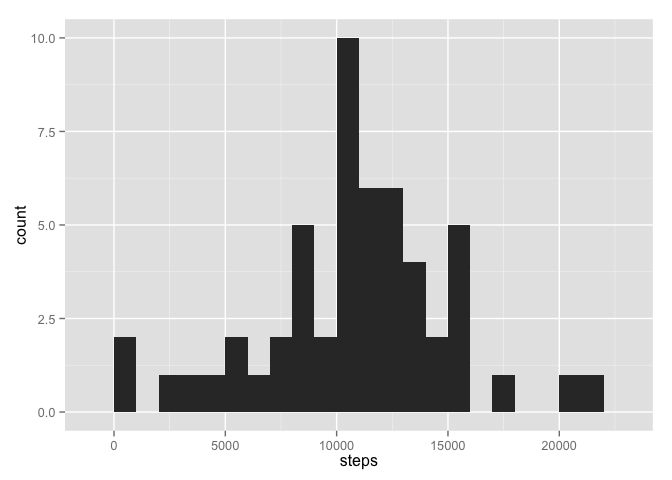
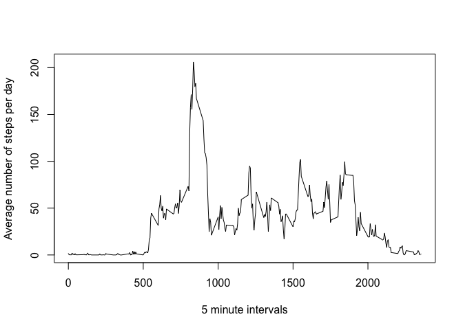
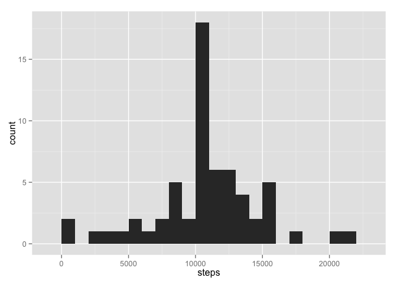
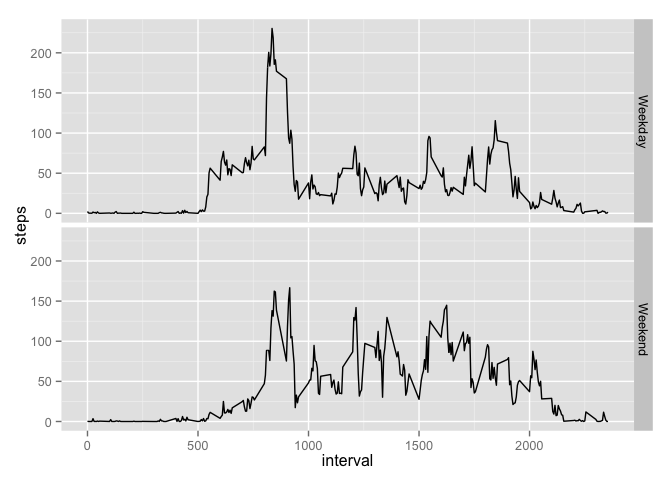

# Reproducible Research: Peer Assessment 1


## Loading and preprocessing the data


```r
activity <- read.csv("activity.csv")
```


## What is mean total number of steps taken per day?

### Histogram of the total number of steps taken each day


```r
library(stats)
library(ggplot2)
totalStepsPerDay <- aggregate(steps ~ date, data = activity, sum)
qplot(steps, data = totalStepsPerDay, binwidth = 1000)
```

 

### The mean and median of the total number of steps taken each day


```r
mean(totalStepsPerDay$steps)
```

```
## [1] 10766.19
```

```r
median(totalStepsPerDay$steps)
```

```
## [1] 10765
```

## What is the average daily activity pattern?

### Time series plot of the 5 minute intervals and the average number of steps taken per day

```r
avgStepsPerInterval <- aggregate(steps ~ interval, data = activity, mean)
plot(avgStepsPerInterval$interval, avgStepsPerInterval$steps, type = "n", 
     xlab = "5 minute intervals", ylab = "Average number of steps per day")
lines(avgStepsPerInterval$interval, avgStepsPerInterval$steps, type = "l")
```

 

### 5 minute interval that contains the maximum number of steps


```r
maxSteps <- max(avgStepsPerInterval$steps)
avgStepsPerInterval[avgStepsPerInterval$steps == maxSteps,1]
```

```
## [1] 835
```

## Imputing missing values

I have decided to populate the missing values with the mean value for that interval. I decided against using the mean of a given day as there are some days that have no interval values at all. Also I believe using the interval mean will be a better approximation of the missing value.  
As you can see there are 2304 records with a missing "steps" value


```r
summary(activity)
```

```
##      steps                date          interval     
##  Min.   :  0.00   2012-10-01:  288   Min.   :   0.0  
##  1st Qu.:  0.00   2012-10-02:  288   1st Qu.: 588.8  
##  Median :  0.00   2012-10-03:  288   Median :1177.5  
##  Mean   : 37.38   2012-10-04:  288   Mean   :1177.5  
##  3rd Qu.: 12.00   2012-10-05:  288   3rd Qu.:1766.2  
##  Max.   :806.00   2012-10-06:  288   Max.   :2355.0  
##  NA's   :2304     (Other)   :15840
```

- The first step it to create a new dataframe containing the mean steps per interval

```r
meanIntervalStepsPerInterval <- aggregate(steps ~ interval, data = activity, mean)
colnames(meanIntervalStepsPerInterval)[2] <- "meanStepsPerInterval"
head(meanIntervalStepsPerInterval)
```

```
##   interval meanStepsPerInterval
## 1        0            1.7169811
## 2        5            0.3396226
## 3       10            0.1320755
## 4       15            0.1509434
## 5       20            0.0754717
## 6       25            2.0943396
```
- Next, this is merged with the activity dataframe to create a temp dataframe, and missing values are updated with the value in the "meanStepsPerInterval" column.  
The dataframe "newActivity" is the new dataset with the missing values populated


```r
tempActivity <- merge(activity,meanIntervalStepsPerInterval)
tempActivity[is.na(tempActivity$steps),2] <- tempActivity[is.na(tempActivity$steps),4]
newActivity <- tempActivity[,c(2,3,1)]
summary(newActivity)
```

```
##      steps                date          interval     
##  Min.   :  0.00   2012-10-01:  288   Min.   :   0.0  
##  1st Qu.:  0.00   2012-10-02:  288   1st Qu.: 588.8  
##  Median :  0.00   2012-10-03:  288   Median :1177.5  
##  Mean   : 37.38   2012-10-04:  288   Mean   :1177.5  
##  3rd Qu.: 27.00   2012-10-05:  288   3rd Qu.:1766.2  
##  Max.   :806.00   2012-10-06:  288   Max.   :2355.0  
##                   (Other)   :15840
```

### Histogram of the total number of steps taken each day using the new dataset


```r
library(ggplot2)
newTotalStepsPerDay <- aggregate(steps ~ date, data = newActivity, sum)
qplot(steps, data = newTotalStepsPerDay, binwidth = 1000)
```

 

### The mean and median of the total number of steps taken each day using the new dataset


```r
mean(newTotalStepsPerDay$steps)
```

```
## [1] 10766.19
```

```r
median(newTotalStepsPerDay$steps)
```

```
## [1] 10766.19
```

After updating the data set with the missing values the mean is unchanged, and the median has slightly increased.


## Are there differences in activity patterns between weekdays and weekends?

- categorize dates as "weekend" or "weekday"

```r
newActivity$dayOfWeek <- weekdays(as.Date(newActivity$date), abbreviate = FALSE)
newActivity$dayType <- ifelse(newActivity$dayOfWeek %in% c("Saturday","Sunday"),"Weekend","Weekday")
newActivity$dayType <- as.factor(newActivity$dayType)
```

- summarize data to calculate the mean interval steps, broken down by interval and type of day

```r
newMeanIntervalStepsPerInterval <- aggregate(steps ~ interval + dayType, data = newActivity, mean)
head(newMeanIntervalStepsPerInterval)
```

```
##   interval dayType      steps
## 1        0 Weekday 2.25115304
## 2        5 Weekday 0.44528302
## 3       10 Weekday 0.17316562
## 4       15 Weekday 0.19790356
## 5       20 Weekday 0.09895178
## 6       25 Weekday 1.59035639
```

- create a time series plot to compare weekdays and weekends

```r
library(ggplot2)
g <- ggplot(newMeanIntervalStepsPerInterval, aes(x = interval, y = steps ))
g <- g + geom_line() + facet_grid( dayType ~.)
print(g)
```

 

Conclusion: There is a difference in the activity patterns on weekdays and the weekend
